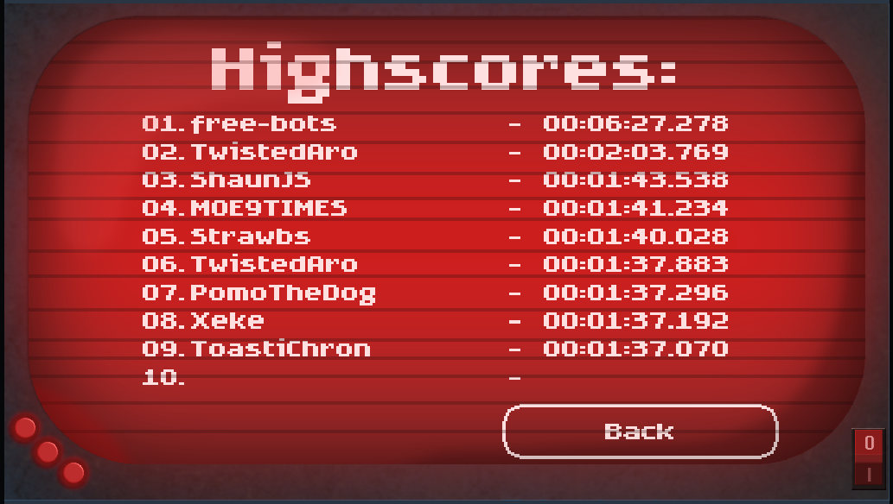

# The Manhattan Project Bot

## This bot plays the game ["The Manbutton Project"](https://andidebob.itch.io/the-manbutton-project) from @AndideBob
##  @AndideBob who is now #1 ? 😜



## Demo
<video height="540" width="960" src="https://user-images.githubusercontent.com/54210595/175767489-f7450fb2-ff66-465a-952e-1a34d5db6384.mp4" controls></video>
## Installation
```
git clone https://github.com/free-bots/the-manbutton-project-bot.git
cd the-manbutton-project-bot
npm i

depending on you os you need to install opencv and build the binding see:
 - https://github.com/UrielCh/opencv4nodejs#how-to-install
 - https://github.com/UrielCh/npm-opencv-build
 - npm run build-bindings

when everything is setup run 'npm run start' and click in the game on the 'qwertz' button
```
